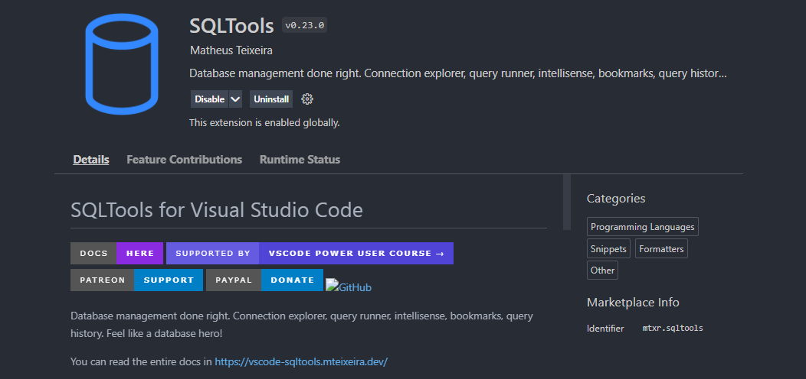
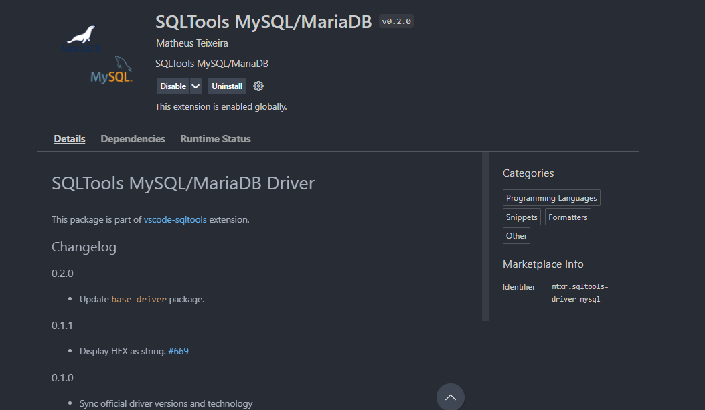

# Praktikum basis data 2021/2022
Menggunakan teks editor vscode dengan extension SQLTools dan SQLTools MySQL/MariaDB
## extension yang di gunakan

## Cara menjalankan
-- @BLOCK sebagai pemisah antar perintah, sehingga bisa langsung di jalankan
-pastikan sudah terkoneksi dengan mysql
-buat database terlebih dahulu di terminal untuk koneksi dengan extension
-untuk praktikum ini menggunakan aplikasi xamp